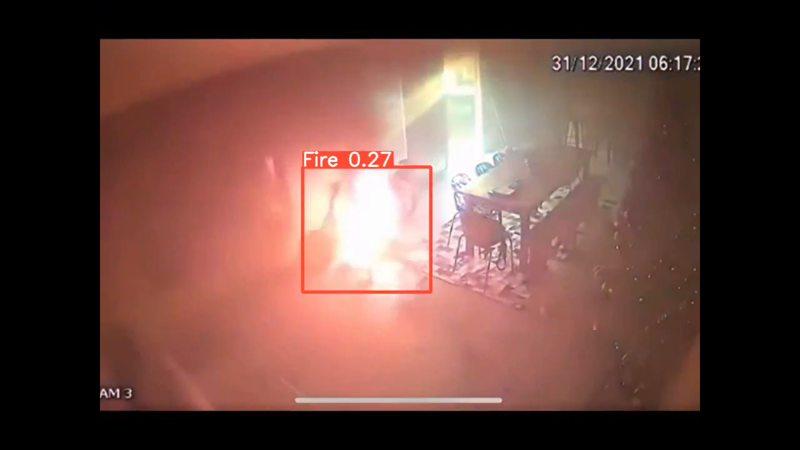

<H1 align="center">Fire Detection using YOLOv8</H1>


## Steps to run Code

- Clone the repository
```
git clone https://github.com/rugved0102/Fire-Detection-using-YOLOv8.git
```
- Goto the cloned folder.
```
cd FireDetectionYOLOv8
```
- Install the dependecies
```
pip install -e '.[dev]'

```

- Setting the Directory.
```
cd ultralytics/yolo/v8/detect
```


- Downloading a Weights from the Google Drive
```
gdown "https://drive.google.com/uc?id=1dCMIamv2XI7xx8ExWNXswDRBfvHhSKfH&confirm=t"
```
- Downloading a Sample Video from the Google Drive
```
gdown "https://drive.google.com/uc?id=1w0SLc5DqdY4s2KRQ9rw944_dx2UwRk5H&confirm=t"
gdown "https://drive.google.com/uc?id=1AVDY5a13cGdTd_0Wj1p93_xiFFEBcxIN&confirm=t"

```
- Run the code with mentioned command below.
```
!python predict.py model='best.pt' source='forestfire4.mp4'
```


### RESULTS

#### Fire Detection 


This repo was forked from https://github.com/MuhammadMoinFaisal/FireDetectionYOLOv8
